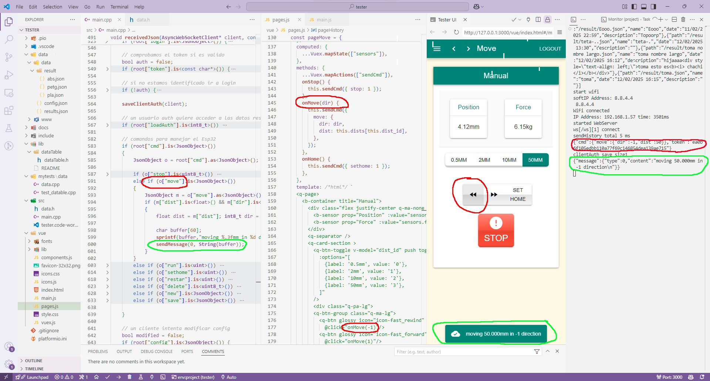
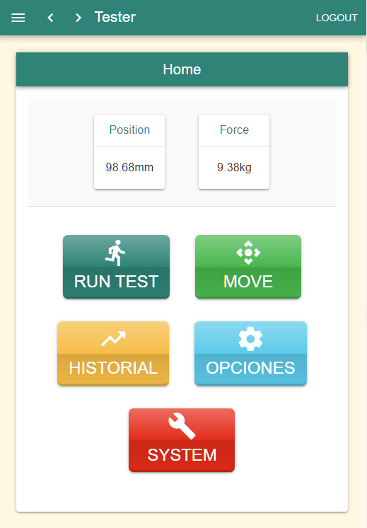
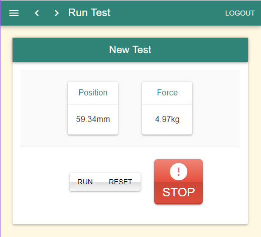
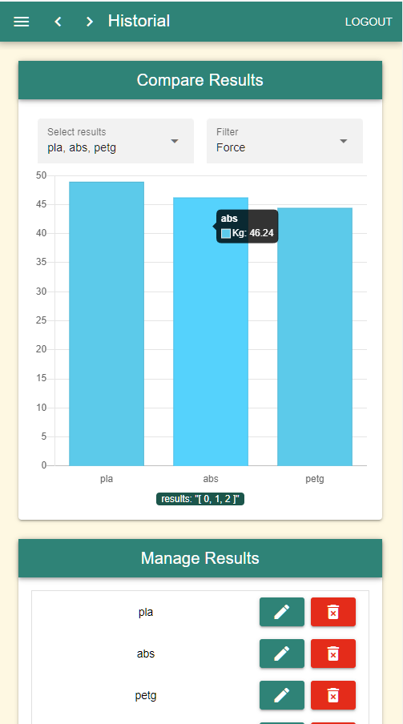
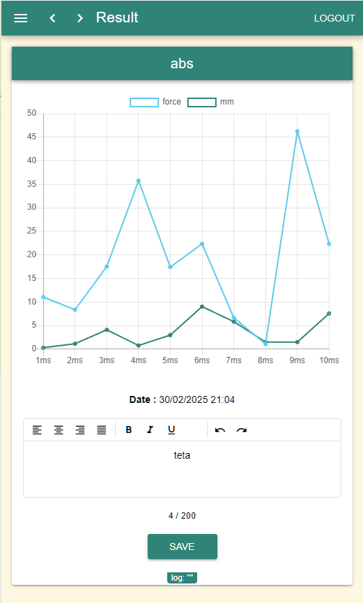
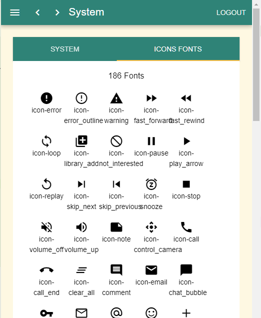
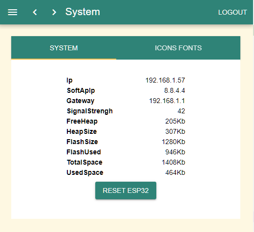

# Plastic Tester

Esto ya no es un "starter kit" estan en la carpeta doc . La aplicación no hace nada en sí, es solo una demostración de **ESPAsyncWebServer** con WebSocket y una interfaz web hecha en **Quasar (Vue 2)**.

Los datos son generados aleatoriamente.

## Funcionalidades

- Sistema de login (usuario único)
- Restricción de acceso a ciertas partes de la web mediante un token por IP
- Control del navegador desde el dispositivo (redirigir al usuario a una página)
- Envío de notificaciones (ok/warn/error) desde el dispositivo
- Actualización de datos del usuario en tiempo real
- Sistema para guardar variables en JSON (admin/wifi, etc.)
- Almacenamiento de datos de ejemplo (limitado a 10 ficheros por lentitud de lectura (recomendación: cachear en memoria ))
- Envío de datos de sensores cada 5 segundos

## Instalación

1. **Editar `config.json`:**
    ```json
    {
      "wifi_pass": "tu pass",
      "wifi_ssid": "tu wifi"
    }
    ```
2. **Subir la carpeta `data` al ESP32:**
    1. Si deseas actualizar/copiar la carpeta `vue` a `data/www` ejecutar:
        ```bash
        python update_data_web.py 
        ```
    2. En PlatformIO:
        - Build filesystem image
        - Upload filesystem image
3. **Compilar el proyecto:**
    1. Upload

## Uso

Por defecto el usuario es:
- **Usuario**: admin
- **Password**: admin

### En PC
- Abre el navegador y ve a [http://tester.local](http://tester.local)
- Cambiar las credenciales del WiFi si es necesario (Pagina Options)

### En Móvil (Android)
El mDNS no funciona en móviles, necesitas usar la IP:
- Si está conectado al WiFi, abre el navegador y ve a la IP de tu dispositivo (ej.: [http://192.168.1.57](http://192.168.1.57))
- Si no está conectado o no sabes la IP:
    - Conéctate al WiFi del dispositivo y abre el navegador en [http://tester.local](http://tester.local) o [http://8.8.4.4](http://8.8.4.4)
    - Copia la IP y cambia las credenciales del WiFi si es necesario (Pagina System/Options)


### Abrir desde `index.html` de la carpeta `vue`
- Editar el `index.html` y cambiar el host poniendo la IP del ESP32:
    ```js
    // Para ejecutar el HTML fuera del ESP32 
    var host = document.location.host;
    if (host === "" || // archivo local
        host === "127.0.0.1:3000") // vista previa en vivo
        host = '192.168.1.57'; // IP del ESP32
    ```

## Vue/Quasar

- Uso **Vue v2** y **Quasar v1** (decidí no actualizar a Vue 3 por ahora)
- No uso CLI, edito el `.js` directamente

## Ficheros del Proyecto
- `index.html`: Inicio y configuración de host y colores de la web
- `main.js`: Creación y configuración de router y Vue
- `vuex.js`: Gestión de datos y eventos WebSocket
- `pages.js`: Definición de las páginas de la web
- `components.js`: Definición componentes usadas en la web (charts)

## Librerías usadas

### C++

- [ESPAsyncWebServer](https://github.com/ESP32Async/ESPAsyncWebServer)
- [AsyncTCP](https://github.com/ESP32Async/AsyncTCP)
- [ArduinoJson](https://arduinojson.org/)

### JavaScript

- [Vue v2](https://v2.vuejs.org/)
- [Vuex v3](https://v3.vuex.vuejs.org/)
- [Vue-router v3](https://v3.router.vuejs.org/)
- [Quasar Framework v1](https://v1.quasar.dev/)
- [Chart.js v2](https://www.chartjs.org)/[Vue-chartjs v3](https://vue-chartjs.org)

## Pantallas








