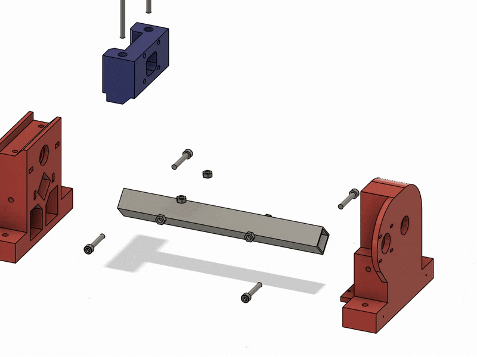

# Plastic Tester

**Demo en YouTube**

[](https://www.youtube.com/watch?v=grObh11XFaI)


## Descripción General

Sistema DIY de bajo coste para realizar ensayos de tracción (*tensile testing machine*) en probetas impresas en 3D. 

Diseñado para:

- Validar la calidad de filamentos para impresión 3D
- Evaluar la adhesión entre capas de piezas impresas
- Obtener datos comparativos entre varios filamentos
- Obtener datos comparativos entre diferentes parámetros de impresión
- Que sea pequeño

El sistema utiliza:
- **Sensor**: Celda de carga económico con HX711
- **Actuador**: Motor paso a paso con driver
- **Control**: Interfaz web accesible vía WiFi
- **Visualización**: Gráficas de fuerza/desplazamiento

**Características principales**:
- Coste aproximado: < 100€ en componentes
- Fuerza máxima: 50kg
- Precisión: ±0.1kg
- Velocidad ajustable: 0.1 - 5 mm/min

## Notas de Desarrollo
- Plataforma: ESP32
- IDE: PlatformIO

## Impresion 3D
- las piezas para imprimir y los ficheros originales(fusion 360) se encuentran en la carpeta
[docs/3d](./docs/3d)


## Montaje
### Frame

[Descargar video](./docs/mount/frame.avi)

### Montar la tuerca T8 en el soporte con los inserts

- cortar los tornillos sobrantes


### Slide

[Descargar video](./docs/mount/slide.avi)

### Completo

[Descargar video](./docs/mount/mount.avi)

### Alineamiento de el soporte de la tuerca T8 con el husillo


el tornillo mide 5.8mm de diametro y los rodamientos tienen 6mm de diametro interior

1. mejor forma
    - centrando el tornillo con cinta aislante,

    - poner 2 trozos de papel de 0.2mm, como la zona donde apoya lleva soporte le deje 0.25mm de holgura 

2. tambien funciona
    - empujando hacia la base y apletando el tornillo

    - poner 4 trozos de papel o mas de 0.2mm

## Hardware

### Celda de Carga (HX711)
```cpp
const int LOADCELL_DOUT_PIN = 26;
const int LOADCELL_SCK_PIN = 25;
const float CALIBRATING_FACTOR = -2316138 / 44.34; // lectura/kg real
```
1. **Poner el HX711 a 80hz** 
    - cortar el cuadrado azul
    - soldar el cuadrado rojo 


2. **Colocar tornillo al sensor**
    - taladrar con una broca de 3mm 
    - poner el tornillo de ojo con 2 tuercas


**nota el tornillo tiene que estar soldado**


### PCB
 - se necesitan 2 resistencias de 1K Ohm

**vista volteada (si miramos desde arriba)**


**vista normal (si miramos por abajo)**


### Circuito completo


### Motor Paso a Paso
```cpp
const uint8_t MOTOR_STEP_PIN = 32;
const uint8_t MOTOR_DIRECTION_PIN = 33;
const uint8_t ENDSTOP_PIN = 27;
```
## Instalación


1. **Editar [config.json](./data/data/config.json): (opcional)**
    ```json
    {
      "wifi_pass": "tu pass",
      "wifi_ssid": "tu wifi"
    }
    ```
2. **Subir la carpeta `data` al ESP32:**
    1. Si deseas actualizar/copiar la carpeta `vue` a `data/www` ejecutar:
        ```bash
        python update_data_web.py 
        ```
    2. Pasos en PlatformIO:
        - Build filesystem image
        - Upload filesystem image
3. **Compilar el proyecto:**
    1. Upload

## Uso

Por defecto el usuario es:
- **Usuario**: admin
- **Password**: admin

### En PC
- Abre el navegador y ve a [http://plastester.local](http://plastester.local)
- Cambiar las credenciales del WiFi si es necesario (Pagina Options)

### En Móvil (Android)
El mDNS no funciona en móviles, necesitas usar la IP:
- Si está conectado al WiFi, abre el navegador y ve a la IP de tu dispositivo (ej.: [http://192.168.1.57](http://192.168.1.57))
- Si no está conectado o no sabes la IP:
    - Conéctate al WiFi del dispositivo y abre el navegador en [http://plastester.local](http://plastester.local) o [http://8.8.4.4](http://8.8.4.4)
    - Copia la IP y cambia las credenciales del WiFi si es necesario (Pagina System/Options)


### Abrir desde `index.html` de la carpeta `vue`
- Editar el `index.html` y cambiar el host poniendo la IP del ESP32:
    ```js
    // Para ejecutar el HTML fuera del ESP32 
    var host = document.location.host;
    if (host === "" || // archivo local
        host === "127.0.0.1:3000") // vista previa en preview (addon visual code)
        host = '192.168.1.57'; // IP del ESP32
    ```

## Vue/Quasar

- Uso **Vue v2** y **Quasar v1** (decidí no actualizar a Vue 3 por ahora)
- No uso CLI, edito los `.js` directamente de la carpeta `vue`

## Ficheros de la pagina web
- `index.html`: Inicio y configuración de host y colores de la web
- `main.js`: Creación y configuración de router y Vue
- `vuex.js`: Gestión de datos y eventos WebSocket
- `pages/`: Carpeta donde estan las páginas de la web
- `components.js`: Definición componentes usadas en la web (charts)

## Lista de la compra

**Los links solo son de referencia** 

| Item                             | Used | (€)  | Link |
|----------------------------------|------|------|------|
| **Componentes Principales**      |      |      |      |
| Screw Trapezoidal T8 300mm P2L2  | 1    | 9,89 | [Link](https://es.aliexpress.com/item/32507277503.html) |
| Nema17 48mm 2A                   | 1    | 13,19| [Link](https://es.aliexpress.com/item/1005004731197516.html) |
| Stepper DRV8825                  | 1    | 1,59 | [Link](https://www.aliexpress.com/item/4000083334758.html) |
| Expansion Board Stepper          | 1    | 1,79 | [Link](https://es.aliexpress.com/item/10000278156894.html) |
| Weight Sensor 50KG               | 1    | 1,30 | [Link](https://es.aliexpress.com/item/1005006668822214.html) |
| HX711 Green Small                | 1    | 1,18 | [Link](https://www.aliexpress.com/item/1005007091731394.html) |
| ESP32 DEVKIT V1                  | 1    | 3,79 | [Link](https://es.aliexpress.com/item/1005008503831020.html) |
| F8-22M Bearing Axial 8x22x7 (x2) | 2    | 1,89 | [Link](https://es.aliexpress.com/item/1005007129279401.html) |
| 606ZZ 6x17x6mm (x10)             | 8    | 3,09 | [Link](https://es.aliexpress.com/item/1005003067718206.html) |
| 608zz 8x22x7mm (x10)             | 2    | 3,89 | [Link](https://es.aliexpress.com/item/1005003067718206.html) |
| Square Alu 25x25x2 - 250         | 1    | 3,59 | [Link](https://es.aliexpress.com/item/1005007456875848.html) |
| Endstop Switch                   | 1    | 2,79 | [Link](https://es.aliexpress.com/item/1005003139255707.html) |
| Lock Collar T8 (x5)              | 3    | 1,69 | [Link](https://es.aliexpress.com/item/1005001667273798.html) |
| Power Supply Jack Socket         | 1    | 0,54 | [Link](https://www.aliexpress.com/item/32838214586.html) |
| Switch (x5)                      | 1    | 1,34 | [Link](https://www.aliexpress.com/item/32873386670.html) |
| XH2.54 Connector                 | 1    | 2,99 | [Link](https://www.aliexpress.com/item/1005007425641197.html) |
| M3xL3xOD4.2 (x50)                | 10   | 1,59 | [Link](https://www.aliexpress.com/item/1005006472702418.html) |
| PCB Board Protoboard 5x7         | 1    | 0,90 | [Link](https://www.aliexpress.com/item/1005006100148769.html) |
| 1K Ohm resistor                  | 2    |      |      |
| **Total Componentes**            |      | 57,03|      |
|                                  |      |      |      |
| **Tornillos y Accesorios**       |      |      |      |
| D Ring Shackle Closed M3 (x2)    | 2    | 2,82 | [Link](https://www.aliexpress.com/item/1005007576884635.html) |
| Nuts M6 (x50)                    | 28   | 4,28 | [Link](https://www.aliexpress.com/item/1005007593861199.html) |
| Nuts M4 (x25)                    | 2    | 1,59 | [Link](https://www.aliexpress.com/item/1005007593861199.html) |
| Nuts M3 (x50)                    | 8    | 1,69 | [Link](https://es.aliexpress.com/item/1005004531602992.html) |
| Screw M6 X 25 (x20)              | 12   | 5,84 | [Link](https://www.aliexpress.com/item/1005003463456440.html) |
| Screw M6 X 60 (x10)              | 6    | 4,48 | [Link](https://www.aliexpress.com/item/1005004527586307.html) |
| Screw M6 X 35 (x5)               | 4    | 1,89 | [Link](https://www.aliexpress.com/item/1005004527586307.html) |
| Screw M3 X 22 (x40)              | 8    | 2,05 | [Link](https://www.aliexpress.com/item/1005004527586307.html) |
| Screw M4 X 20 (x20)              | 2    | 1,95 | [Link](https://www.aliexpress.com/item/1005004527586307.html) |
| Washer M6 12x1.5 (x50)           | 8    | 2,06  | [Link](https://www.aliexpress.com/item/1005004527586307.html) |
| Sheep Eye Screw M3 (x10)         | 2    | 2,59 | Local Seller |
| Threaded Rod M6 -1000            | 1    | 0,80 | Local Seller |
| Plywood Board 340x160x20         | 1    | 6,00 | Local Seller |
| **Total Tornillos**              |      | 38,04|      |
| **TOTAL GENERAL**                |      | 95,07|      |
|                                  |      |      |      |
| **Herramientas**                 |      |      |      |
| Crimping Plier XH2.54            | 1    | 9,39 | [Link](https://www.aliexpress.com/item/1005006224244342.html) |


## Librerías usadas

### C++

- [ESPAsyncWebServer](https://github.com/ESP32Async/ESPAsyncWebServer)
- [AsyncTCP](https://github.com/ESP32Async/AsyncTCP)
- [ArduinoJson](https://arduinojson.org/)
- [FastAccelStepper](https://github.com/gin66/FastAccelStepper)

### JavaScript

- [Vue v2](https://v2.vuejs.org/)
- [Vuex v3](https://v3.vuex.vuejs.org/)
- [Vue-router v3](https://v3.router.vuejs.org/)
- [Quasar Framework v1](https://v1.quasar.dev/)
- [Chart.js v2](https://www.chartjs.org)/[Vue-chartjs v3](https://vue-chartjs.org)

## Screens


## Galeria


**he usado un eje de acero 2x13mm** (una broca cortada en mi caso)

- se mete por la ventana "usb"

